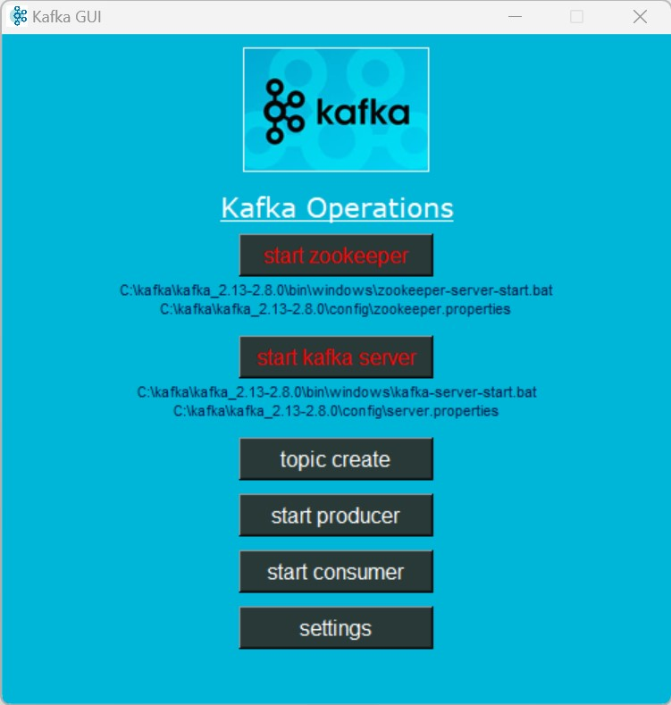

# kafka-run-app  : Kafka EasyConnect Software

Welcome to Kafka EasyConnect - a user-friendly tool for easily connecting to Kafka and Zookeeper, as well as managing Kafka services.

## Installation

You can download the Kafka EasyConnect software for Windows using the following options:

- [Download .exe Installer](https://www.dropbox.com/scl/fo/86vqucim26hq16tdlqvov/h?rlkey=f46u9l7m79ccf754r7sn3gpvl&dl=0)
- [Download Zip Folder](https://www.dropbox.com/scl/fo/c5wgjjva9s1y8e6098269/h?rlkey=meue840lv22ds3o706n09dtlc&dl=0)

**Note:** The software installation requires administrator mode on Windows.

## Dashboard Preview
<!--  -->

## Getting Started

Follow these steps to get started with Kafka EasyConnect:

1. Install the software using one of the provided installation methods.

2. Set the `KAFKA_HOME` Environment Variable:
   - Right-click on the Computer icon and select "Properties".
   - Click on "Advanced system settings".
   - In the "System Properties" window, click the "Environment Variables" button.
   - Under the "System variables" section, click "New" and add a variable with the following details:
     - Variable name: `KAFKA_HOME`
     - Variable value: Path to your Kafka installation folder
   - Click "OK" to close the windows.

3. Start Zookeeper:
   - Open the Kafka EasyConnect software.
   - Go to the "Services" tab.
   - Click "Start Zookeeper".

4. Start Kafka Server:
   - In the "Services" tab, click "Start Kafka Server".

5. Create a Topic:
   - Navigate to the "Topics" section.
   - Click "Create Topic" and provide the necessary details.

6. Run Producer and Consumer:
   - In the "Producers" tab, click "Run Producer" and configure the producer settings.
   - In the "Consumers" tab, click "Run Consumer" and configure the consumer settings.

## Stopping the Services

Follow these steps to stop the Kafka services and Zookeeper:

1. Stop Producers and Consumers:
   - In the "Producers" and "Consumers" tabs, click "Stop" to halt any active producers and consumers.

2. Stop Kafka Server:
   - In the "Services" tab, click "Stop Kafka Server".

3. Stop Zookeeper:
   - In the "Services" tab, click "Stop Zookeeper".

## Feedback and Support

If you encounter any issues or have suggestions for improvements, please feel free to [create an issue](#) in the GitHub repository for this project.

---

*Disclaimer: This software is provided as-is without any warranties. Use at your own risk.*
